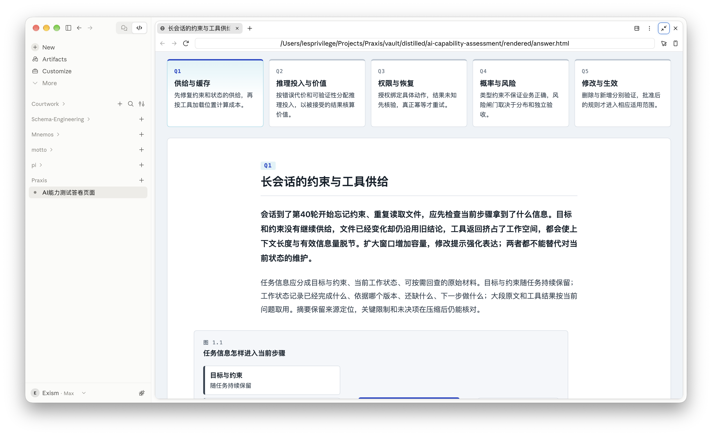

# Q1 首屏版式审阅与返工裁决

本次使用Product Design audit方法，范围限定为用户明确提供的Q1桌面截图和审阅时的CSS。截图按原字节保存并重新打开核对。CUA启动时报Node runtime不存在，未取得当前页面交互或其他题目的新截图；不宣称完成全流程、响应式或可访问性验收。

## 1. Q1首屏：信息层级失衡

五个题目仍可辨认，主文完整，当前题也有定位。问题集中在容器层级、导航占比、文字重量和对齐关系。

| 观察 | 当前证据 | 对阅读的影响 | 裁决 |
|---|---|---|---|
| 五张同权大卡常驻顶部 | 截图上方横向五卡；CSS `.cards ol` 五列、`.card` 高度100%、三像素上边框、当前页渐变 | 未阅读前就要扫过其他四题的完整判断；导航与主内容争夺注意力 | 默认紧凑题签导航，保留可展开的纲要卡，不再常驻展示五段摘要 |
| 长文包在巨型白色圆角容器里 | `.q-page`背景、边框、圆角与大padding；其内部再用44rem居中 | 同时出现页面外边距、容器内边距、段落二次居中；留白来源重复，首屏内容被推远 | 去掉文章外壳，建立一层页面网格，正文和图表依同一网格安排 |
| 首段整段更大更重 | `p.lede`为1.1rem、600字重，连续多行 | 读者难以区分真正关键判断与普通解释；重文字面积超过标题 | 首段恢复普通正文字重和字号，不用整段强调替代论证层次 |
| Q编号、标题横线与卡顶线重复标记层级 | `.q-num`冰青底标签、`.q-title`底线、`.card`上边框 | 每层都有一个视觉标记，形成模板拼接感 | Q编号成为安静序号；保留一个标题层级，不为各层再加装饰分隔 |
| 图表外框继续包节点卡 | 截图下部；`.exhibit`底色、边框、圆角、padding，再包`.src/.flow-node` | 容器数量上升，却未增加数据或关系语义 | 外展项开放排布，只为真实节点、数据输入或比较边界使用容器 |
| 正文与图的宽度轴不同 | 正文44rem、展项52rem，两者在72rem大面板中各自居中 | 相邻内容起点跳动，段落与图像像拼接的组件 | 正文、图题与展项有明确网格关系；宽图、并列图文与文字列可以不同宽度，避免无意的独立居中 |

## 根因修正：内容投影没有论证层级

用户进一步指出，去卡片和调整字号仍不能恢复Pages式编排。代码检查确认blocks()只处理h1/h2/p，渲染器把第一段自动标为lede，按段首匹配插入展项；它没有表达分论点、主图与子图、图文对应。Luna的CSS触点定位有效，但“主要改CSS即可”方案不采纳。

完整构图以[page-composition](page-composition.md)及[37段映射](page-composition.json)为准；下述排版清理只作为后续一层。真实参考的具体消费见[图文编排锚点](../frontend-design/composition-anchors.md)。

## 返工构图

使用浅色冷调的阅读页面。顶部是一条低矮题签导航，显示Q1–Q5与短标题；“纲要”作为可展开控件，展开后显示已有五张卡，正文阅读状态默认收起。卡片仍存在，但不占据每题的首屏。展开与收起应明确、可键盘操作，不按滚动时机突然跳动。

页面只设一个内容网格。建议实现起点是总内容宽度约1040px、正文约720–760px，通过明确网格关系对齐；宽展项可向右占用剩余空间。桌面与窄屏分别核对，不把建议数值当成固定设备真理。去掉`.q-page`大边框、背景差和圆角，不以另一个更大的卡片替代。

标题与正文形成两级主要文字层次。标题约28–30px，正文16–17px、400字重、行高约1.7–1.8，首段与其他段落保持一致。字号是返工初始值，真实视口和中文换行验收后调整。母稿内容不删改，不在正文添加新导语、摘要或作者旁白。

图题、数据图、精确值与相邻解释共同组成一个展项，不默认加灰底圆角外框。节点框、表格线和输入边界只用于真实对象或关系。冷色强调集中于当前导航、交互控件和图形区分，去掉卡片渐变、重复彩边及无语义阴影；配图不承担修复版式的任务。

## 实现验收

1. 在1440×900的网页内容视口检查Q1默认阅读状态：导航约一行高，标题紧接导航，首个必要展项的标题可在首屏看到；不得裁剪、缩小或隐藏正文换取通过。
2. 纲要可展开且五张卡全部可达；关闭后恢复阅读位置。五题hash、刷新、前进后退和Q4合法输入状态保留。
3. 首段没有整段加粗；正文、图题与展项的网格关系明确；文章没有外层卡片；逻辑节点与图表外壳不混淆。
4. Q4两组预设、非法输入、精确值及无JS退化保留。Q3 unknown和Q5原子变化不因去容器丢失语义。
5. 窄屏和200%文字缩放实际检查，不凭桌面截图推断；打印输出五题且允许续页，不打印常驻导航或仅打印当前题。
6. 实现方提交相同视口的修改前后截图、Q4交互回执和打印检查。运行成功或源码存在不等于视觉审阅通过。

本次只修订[唯一Claude工单](claude-paste-order.md)及其依据，未改动renderer代码。原截图与样式身份见[登记](../../intake/assessment-layout-review-20260923.json)。

## 2. 缓存小节：文字与图表重复承担说明

[用户13:45截图](../../snapshots/local/downloads/assessment-layout-review-20260923/02-user-cache-section.png)中，长段已经说明三种路径和计算，图再复述分支和算式；小标题与图题再次重复判断。返工改为一个费用拆分说明、一个并列比较和必要的后续解释。信息保留，改变表达的归属。

## 3. Q1开头：页内目录重复标题

[用户13:47截图](../../snapshots/local/downloads/assessment-layout-review-20260923/03-user-q1-outline.png)在开场和正文之间再次列出三个小节，随后又逐项重复标题。短页已有全局导航与可见小节，删除这段local目录。分隔线减少不能单独解决问题，需要把位置留给论证。

核对磁盘HTML已经使用新Q1标题，但仍早于最新母稿；因此不能声称截图代表当前磁盘构建。与此同时，当前render_page仍把原段落逐个输出后插图，结构性重复确实存在。composition已升级2.0，以required_claims代替逐段原样显示，并给出Q1缓存节完整editorial unit。当前renderer尚未实现该新协议；本轮未重建页面。
