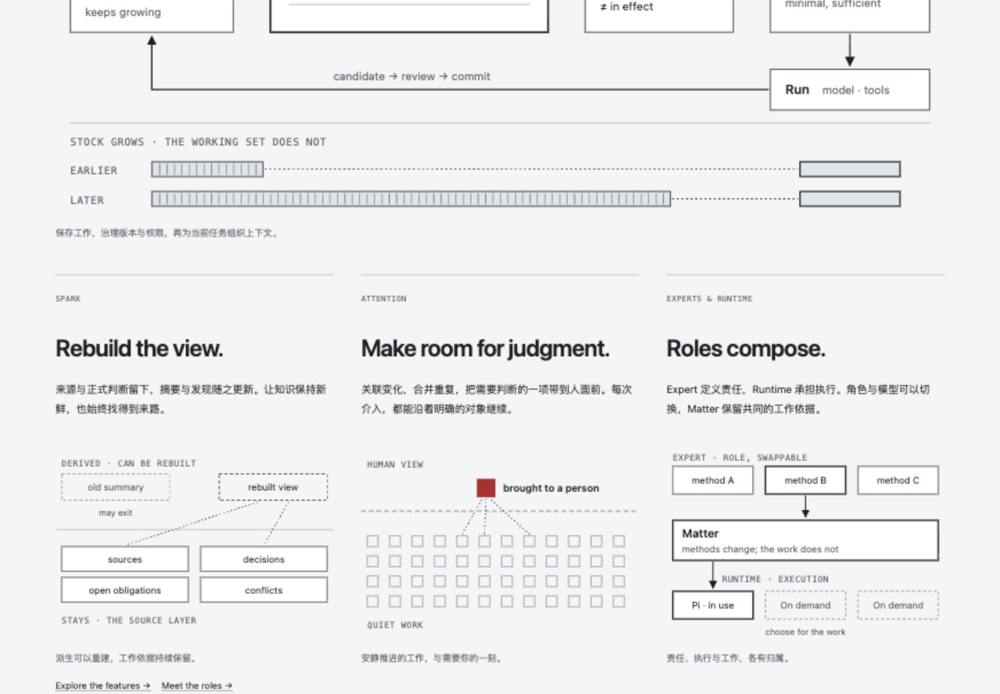
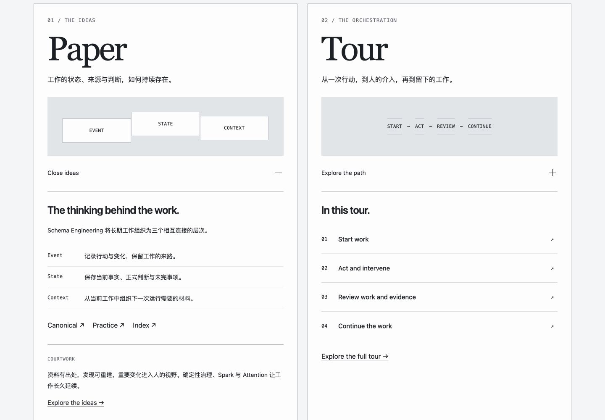

# 从真实页面到构图决定

两张图是Courtwork已有的历史截图，本轮已打开查看，仅作参考。它们不证明当前答卷或当前源仓库的渲染状态。来源与hash见[登记](../../intake/frontend-composition-anchors-20260923.json)。

## 主关系与分论点

这张局部截图的上缘截断了主图，不据此审阅完整首屏。下方三个分区清楚体现了同一构图机制：短标题提出子判断，正文解释关系，紧随的图形分别表达派生、需要介入的一项、角色与执行的分离。三个图不是同一张卡片换文字；线型、位置、数量和箭头分别承担关系。上层主图与下层分区构成总分层级。

在答卷中，Q1应把工作集、版本变化与缓存路径分开解释，Q5应把原子修改、适用范围和独立发布分开；不机械复制三栏数量，也不把全部段落塞进等权模块。具体规则在[五页编排](../ai-capability-assessment/page-composition.md)。

## 不同内容用不同组织方式

Paper与Tour有各自的内容对象：左侧用语义层次及解释行组织概念，右侧用动作序列组织路径。它们共享网格和间距，但并未共享一套内容模板。这里借用的是对照双方各自有适当图式与阅读顺序，不采用巨大衬线标题、原色或原产品文案。

答卷同样需要区别：Q2是路由与数量比较，Q3是带条件的状态分支，Q4是概率分布，Q5是变更与发布证据。使用同一套圆角框容纳这些关系，不算完成视觉设计。

## 消费验收

来源登记只证明材料被找到。消费成立还需要：指出所借的可见机制、映射到本题关系、定位到当前构图、提供真实页面截图核对。工单列了参考链接但页面没有对应结构，仍属于未消费。

当前答卷已据此重写[构图与段落映射](../ai-capability-assessment/page-composition.json)和[Claude工单](../ai-capability-assessment/claude-paste-order.md)，尚无返工后的页面截图；不能把这份材料称为页面已修复。
