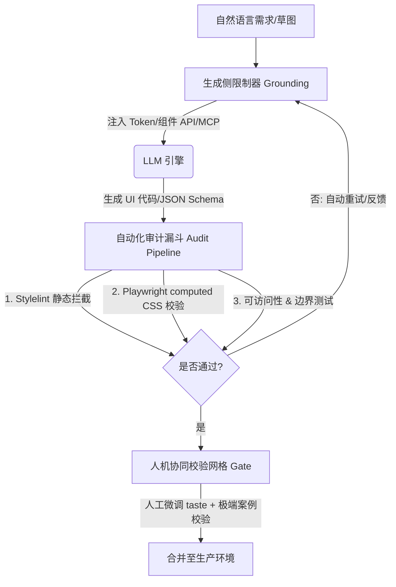

# 互联网关于“清洗 UI/UX 设计 AI Slop”的方案调研报告

在 AI 生成设计与代码（即“Vibe Coding / Vibe Design”）席卷行业的背景下，**“AI Slop”**（AI 废料/垃圾）已成为 UI/UX 领域最严峻的挑战之一。

在 UI/UX 中，**AI Slop 表现为：** 同质化的视觉套路（如暖黄奶油底+衬线体、紫粉色霓虹渐变、过度使用毛玻璃卡片）、空洞无逻辑的静态界面布局，以及无法适配真实业务数据的“Happy Path”页面。此外，AI 随意发明 Token 和类名会导致**“设计系统漂移（Design System Drift）”**。

本报告系统梳理了目前设计工程界对抗、清洗和过滤 UI/UX 中 AI Slop 的主流方案，分为**生成前约束、编译/运行时审计、提示词机制优化、以及人机协同校验**四大支柱。

---

## 方案架构图 (Anti-Slop Pipeline)



---

## 一、 生成侧限制：从源头清洗 AI 的“即兴发挥”

最根本的清洗方式是**不让 AI 拥有自由发明 HTML 结构和 Tailwind 类名的权力**。

### 1. Token-First Grounding (基于 Token 落地生成)
*   **做法**：通过系统提示词或本地上下文，将设计系统的 **Design Tokens (JSON)** 强行喂给 AI。限制 AI 只能使用已有的语义 Token（如 `var(--color-bg-page)`、`var(--radius-md)`），一旦 AI 输出类似 `bg-[#ab33ff]` 或 `rounded-[23px]` 的具体数值，即被判定为 Slop。
*   **落地工具**：如 [Superdesign](https://superdesign.dev) 等工具，将 Figma Variables 与代码 Token 同步，AI 生成的代码被严格局限在预设的 Token 字典中。

### 2. Structured JSON Layout Engines (结构化 UI 协议引擎)
*   **做法**：摒弃直接让 AI 生成 raw HTML/Tailwind 代码的模式。AI 只负责输出**符合特定 JSON Schema 的树状结构**。
*   **原理解析**：
    AI 引擎输出类似如下的 JSON 结构，并由系统前端组件（React/Vue）进行确定性渲染：
    ```json
    {
      "component": "Card",
      "props": {
        "variant": "outline",
        "padding": "md"
      },
      "children": [
        { "component": "Text", "content": "合同审查风险" }
      ]
    }
    ```
*   **适用场景**：[Puck Editor](https://puckeditor.com) 或 Builder.io 等可视化构建工具。这从根本上清洗了“AI 乱写布局、乱写 CSS”的可能性，将 AI 限缩在已有组件的“拼装者”角色。

### 3. MCP (Model Context Protocol) 组件服务器
*   **做法**：在开发环境中配置 MCP 服务，主动向大模型暴露当前组件库的 API 目录、组件 Props 类型和设计规范。AI 每次生成 UI 时，先通过 MCP 检索可用的标准组件，禁止其从零手写。

---

## 二、 自动化审计漏斗：在编译/测试侧拦截 Slop

当代码已经生成后，通过自动化测试管道对视觉和代码进行“脱水”与“清洗”。

### 1. Stylelint 与 Tailwind 静态代码审查
*   **做法**：在 CI/CD 流程中加入严格的代码静态审查：
    *   **Stylelint/ESLint 规则**：禁止使用 Arbitrary Values（任意值，如 `h-[99px]`），强制必须使用 Tailwind 预设的 Step。
    *   **类名排序与合并**：利用 `prettier-plugin-tailwindcss` 强制重整 AI 杂乱的无序类名，识别并剔除 AI 塞入的无用 CSS。

### 2. 基于 Headless Browser (Playwright/Puppeteer) 的 computed CSS 审计
*   **做法**：
    1.  利用 Playwright 渲染 AI 生成的测试页面。
    2.  注入一段 JS 脚本，提取页面上所有主要元素（Body, H1, Button, Input）的 `window.getComputedStyle` 实际渲染数值。
    3.  编写断言脚本进行校验：
        *   `if (computedBgColor !== '#ffffff' && computedBgColor !== '#fafafa') -> 报错 (拦截奶油底)`
        *   `if (computedFontFamily.includes('Serif') && !isEditorial) -> 报错 (拦截滥用衬线标题)`
        *   `if (buttonBorderRadius > 8px) -> 报错 (拦截过度圆角)`
*   **作用**：建立数字化的“视觉防漂移警戒线”，不符合设计系统标准的页面直接拒绝合并。

### 3. 自动化视觉回归测试 (VRT, Visual Regression Testing)
*   **做法**：利用 Chromatic 或 Playwright Snapshots，将 AI 生成的 UI 与“黄金标准组件（Golden Standards）”进行像素级对比，自动检测间距（Margin/Padding）、对齐方式和层次结构是否发生了“设计系统漂移”。

---

## 三、 提示词工程：明确的“反套路”规范

AI 生成 Slop 的主要诱因是**提示词的模糊性**（如“make it clean and modern”）。必须使用带有负向约束的“确定性规则提示”。

### 1. 明确规避“视觉陈词滥调” (Negative Constraints)
在 AI 生成 UI 的 prompt 模板中，系统级地追加**反套路指令**：
> "AVOID the following AI design clichés:
> - Warm butter/cream backgrounds (e.g., #fcfaf2, #fbfaf5) combined with serif display headers (e.g., Playfair, Georgia).
> - Glowing violet/purple gradients behind dark cards.
> - Floating cards with massive multi-layered box-shadows.
> - Excessive padding and low-density layouts suitable only for consumer apps."

### 2. 注入“Taste Anchors (审美锚定)”
*   **做法**：提示词中不要使用形容词，而是提供结构化的事实与参考样本。例如：“请参考 Vercel 的单色几何分割线风格、Linear 的 -0.01em 字间距处理、以及 Raycast 的等宽按键样式。全站仅能使用黑白灰与语义色，不允许添加任何装饰性渐变。”

---

## 四、 人机协作与边缘用例网格 (Human-in-the-Loop Curation)

AI 容易生成好看但“不可用”的 Happy Path（即在完美文案长度下好看，但在真实多变数据下崩溃）。

### 1. 强制性“边缘用例网格 (Edge Case Grid)”测试
设计一套“AI 必须回答的 UI 适应性矩阵”，要求 AI 在交付界面时，自动生成并测试以下状态：
*   **Empty State (空数据状态)**：页面没有任何案卷时显示什么？
*   **Loading State (加载骨架屏)**：法条检索时展示什么？
*   **Error Popups (错误反馈)**：网络中断或上传失败如何展现？
*   **Overflow State (长文本溢出)**：如果合同名称长达 200 字，标题栏是否会重叠或折行？
*   **Responsive Reflow (自适应测试)**：在 13 寸小屏 Macbook 和 27 寸大屏上各自的排版。

### 2. “组件注册表”双重防线 (Gatekeeping)
即使 AI 生成的代码通过了自动审计，仍需设立最后一道门槛：
*   AI 生成的自定义 UI 片段必须经过人工（Designer/Lead Engineer）的 Taste Check，打上标有“Verified By Human”的元数据后，才允许注册进组件库，防止未经审查的 Slop 污染主代码库。

---

## 💡 总结：面向“桌面法律工作台”的清洗方案落地建议

对于您正在开发的桌面法律工作台，在对抗 AI 带来的设计同质化时，可以采取如下**最小可行清洗闭环**：

1.  **代码级 Lint 拦截**：在项目中配置 ESLint / Stylelint，彻底禁用 Tailwind 任意值。AI 生成代码时，任何硬编码的 CSS 色值（如 `#ab33ff`）或尺寸都会在编译期报错被洗掉。
2.  **建立 `DESIGN.md` 上下文**：为您的 Antigravity AI 或其他生成助手编写一份硬核的 `DESIGN.md`，写明“冷调极简、高密度、零彩色预算、只允许使用 PingFang SC / MiSans 的无衬线体系”。
3.  **开发一个简单的 Playwright computed CSS 检测脚本**：每当 AI 产出新页面，自动运行脚本检测背景色是否偏离了冷灰/冷白色（如 `#f8f9fa`），是否错误引入了衬线体。
