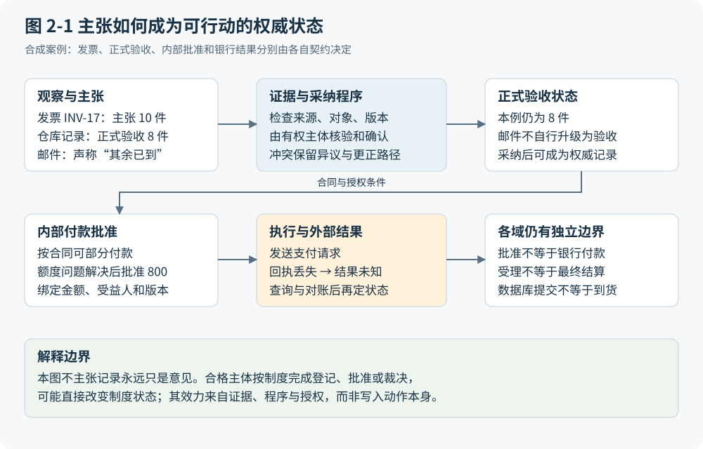

# 第 2 章 谁知道事实 谁能作出承诺

## 同一对象可以有互不相同的正确记录

上一章的采购停在一道差异上：INV-17 主张 10 件、合计 1,000 单位货币，Warehouse-1 的正式验收记录为 8 件。两条记录可以都被准确录入，却不能因此合成为“交付 10 件”。前者准确表达供应商提出的付款主张，后者表达有来源、有时间和版本的验收。数据准确首先回答是否忠实保存原来的表达，现实是否如表达所述则需要另一步判断。

再加入一封“其余已到”的邮件。邮件可能提供重要线索，甚至最终被证明正确，但按本案例政策，正式验收仍需仓库确认。系统应当把邮件连接到尚待判断的 2 件差异，交给有权确认者处理。直接覆盖验收数量会隐藏程序缺口；丢弃邮件又会损失推动工作的线索。两种错误分别来自过早相信和过早拒绝。

因此，可行动表示应至少让人区分现实中的发生、参与者的观察、保存下来的主张，以及按适用程序正式采纳的状态。来源链有助于表达一份材料由谁生成、经过何种活动派生、由谁承担相关责任。W3C 的 PROV-DM 提供这样的实体、活动及参与者关系；它支持可信度评估，却不会自动证明材料为真，更不会自行授予付款权限。[F12](https://www.w3.org/TR/2013/REC-prov-dm-20130430/Overview.html)

## 把四种状态分开才有办法继续

P2P 至少需要并行观察四种状态。事实表示保存目前有哪些主张和证据；承诺状态说明谁对谁负有什么有条件的义务；授权状态说明谁可对特定对象采取何种行动；执行与验收状态说明尝试、外部效果和接受结果分别到了哪里。它们是本书的分析视图，不要求物理上必须有四张表。

在合成轨迹中，PO-42 已经获得采购授权，不能据此推定每次支付也已获批。8 件正式验收支持按合同假设形成本期 800 的付款判断，但还需要具体金额、受益人、版本和有效范围上的支付授权。余下 200 保持待验收或争议，并不因为系统暂不付款便不复存在。稍后若付款批次未预留的额度被另一请求占用，BudgetHold 又属于内部执行条件；它既不证明银行现金不足，也不重新解释货物到底到了几件。

Winograd 的行动语言视角区分请求、承诺、声称已满足条件，以及请求方接受；实际执行还需要在这些言语行动之外发生。[F05](https://dl.acm.org/doi/10.1207/s15327051hci0301_2) 这个区分的用途可以直接检验：如果供应商说“已经送到”，系统能够追问由谁验收；如果审批者说“同意支付”，系统能够检查批准对象；如果运行时说“任务完成”，系统能够继续核对银行结果。把它们压成一个状态枚举，会迫使某个标签同时承担不相容的含义。

## 权威不是全知 记录也并非永远只是意见

指定 Warehouse-1 的合格验收者有权正式确认，并不意味着该人不会数错。权威回答的是在当前制度下，谁能按什么程序改变哪一种状态；真实性仍可能受到新证据挑战。合格设计需要说明确认的范围、依据版本和可更正路径。仓库补充调查可以形成更正，财务已经完成的记录则可能需要调整或冲销。直接删除原记录会使后来者无法解释当时为什么作出决定。

反过来，也不能把数据库里的内容永久降格为无效主张。经有权主体按程序作出的批准、登记或裁决，可能本身就构成制度状态的改变。一次有效批准不是对未来批准的猜测。它的效力来自授权、适用规则与程序条件，数据库承担保存和执行这些关系的工作。这里应区分“数据库写入使一切为真”和“合格程序可以通过数据库形成有效状态”这两个命题。

旧式签字、合同、收货单和凭证在这种条件下有实际作用。稳定格式让复核者找到对象，签署身份使责任有着落，原件及版本让双方讨论的是同一次表达。这是它们的机制合理性，不保证纸张或人工签字一直优于数字机制。可靠的电子采纳和授权路径可以替代载体，但仍须交代如何确认主体、范围及结果。图 2-1 将证据核验、适用程序、授权主体和更正分支放在一起。它描述有条件的采纳路径，不能读成任何主张都必然升级为权威状态的单向流水线。

图 2-1：区分主张、权威采纳、内部批准与外部结果。本书原创综合；相关依据：F05、F12、F13、A005。

## 分类会把成本和权力一起写进系统

把邮件归为“普通附件”或“验收证据”，会影响谁需要追加工作、谁可以继续付款，以及发生争议时谁必须证明什么。Suchman 对行动语言分类的批评提醒我们，固定类别可能把特定的组织控制方式嵌入协作工具，遮蔽互动的情境与异质性。[F06](https://www.lri.fr/~mbl/ENS/CSCW/2017/papers/Suchman-JCSCW94.pdf) 这不是一切分类有害的证明，而是要求设计者说明分类权和纠错权。

例如，若供应商可以正式申诉，系统必须保存异议、对应证据、处理时限与裁决路径；若组织只接受内部终审，过程会不同，外部关系和争议风险也不同。不能先删除申诉入口，再把由此减少的工单数当成效率提高。证据整理劳动可能由软件承担，最终的验收或例外决定仍需落到获授权的主体；Agent 能执行被授予的动作，不能因为它掌握更多信息就自行创设权力。

本章的分类因此应落实到具体关系。需问责支付能区分依据、授权与后果，是限定范围内的 I；只能由人识读纸面材料，是可能变化的 H；签字栏、角色表和独立批准对象，是 D；经验证既不增加证据也不形成新授权的重复确认，才可能属于 A。删除确认之前要检查谁承接复核、解释和争议处理的成本，不能只计算点击次数。

## 不要把探索过早写成承诺

承诺模型最强的反例是目标尚未形成的探索。两位研究者讨论“是否应换供应商”，可能通过查看交期分布才发现真正的问题是验收口径不一致。如果系统要求他们在开始时就指定交付物、固定下一步和唯一验收标准，它会把学习活动误写成未完成任务，甚至诱导参与者挑选容易交差的结果。

这类工作仍有身份、来源、资源和权限边界，但需要保留假说、暂定解释和修订问题的空间。讨论中一句“可以试试”也不应自动成为组织承诺。若将来源、承诺和接受全部强制形式化，额外标注会由参与者承担，省下的管理解释劳动可能以更大的表达负担回到一线。是否值得，应在实际工作中观察，而不能由模型命名决定。

对交易任务，本章可以交出一份简短但可执行的检查契约：每个待采纳主张都连到对象、来源、时间与版本；正式采纳说明适用程序和决定主体；授权绑定具体动作及范围；执行结果保留未确认状态；异议能够指回被挑战的判断。对于探索任务，契约改为保留假说及改变问题的理由。本书尚缺真实争议和非正式协作的充分材料，两种契约都需接受现场检验。下一章将追问，这些区分能否组成有诊断力的软件模型，而不变成另一套包罗万象的名词。
