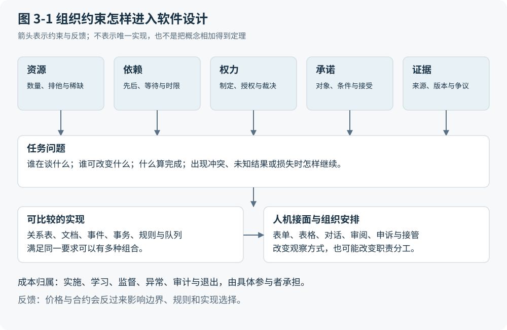

# 第 3 章 怎样分解软件而不把今天的产品当自然法则

## 好分解要改变设计判断

前两章得到的并非一份产品清单，而是相互依赖的参与者、可争议的主张、承诺、决定权及行动后果。接下来若把这些关系分别装入“数据库”“工作流”“权限系统”，很容易误把现有工程分工当成现实世界的天然结构。工程分层有助于分配开发责任，产品门类有助于采购与运维，却不自动说明每一层永远必要。

判断一种分解是否有用，可以先看它是否改变具体诊断。面对 INV-17，只有“数据模块出错”这一结论，既无法判断应修复识别器还是补充验收，也无法找出谁可批准例外。若模型明确区分主张、证据与授权，就能分别设计测试：正确读取发票后差异是否仍在；补充正式验收是否改变匹配；匹配通过后是否仍缺支付授权。分解的价值在于产生可区分的失败条件和修复动作，而非把盒子数量压到最少。

经典模型提供不同镜头。Codd 将逻辑关系与物理表示分开，Chen 讨论可区分对象及关系，Gray 把事务置于受约束的状态变换中；协调理论则从活动依赖比较机制。[F01](https://dl.acm.org/doi/pdf/10.1145/362384.362685) [F02](https://www.comp.nus.edu.sg/~lingtw/papers/tods76.chen.pdf) [F03](https://jimgray.azurewebsites.net/papers/thetransactionconcept.pdf) [F04](http://ccs.mit.edu/papers/CCSWP157.html) 它们分别支持一部分推导，不能被拼接成一条已有文献证明的企业软件统一定理。

## 四种视图 各自遗漏什么

第一种视图是“记录、Agent 运行时、注意力”。它适合重新分配检索、执行和人工介入的位置：机器找到卡住的发票，人处理少数需要判断的情况。然而，记录可能包含相互冲突的主张，运行时未必拥有付款权，注意力也没有区分审阅劳动和裁决责任。两方对履约有争议时，增加上下文或调用更多工具不能自行生成共同认可的结论。因此，本书把它留作产品重构视图，而不让它预先规定所有任务都有 Agent。

第二种视图列出状态、规则、协调、执行、观察与治理。它能提醒设计者在自动行动之外检查反馈和控制，适合作为覆盖清单。它的弱点是容纳能力太强：供应商停产后需要重新谈判，任何困难都可以被塞进“协调”或“治理”，却仍不知道谁承担延期损失。若类别不能导出不同的动作与评价条件，分类只是换了一种说法。

第三种视图围绕事件、承诺和资源转换。它能解释订单、验收、应付与结算为何相互关联，也保留不同主体之间的义务。REA 原论文的摘要与开头提供经济资源、事件、主体及共享信息的对照，但本稿未核读其全部细节，更不把本书的承诺扩展称为 REA 已有结论。[F07](https://home.business.utah.edu/actme/7410/McCarthy-82.pdf) 这一视图对 P2P 有用，却容易把研究与探索过早变成固定交付。

第四种视图把任务视为受约束、部分可观测的多参与者协作。它能容纳反馈、不确定性和目标修订，但也有代价。如果把权利、职责分离或明确禁止的行动全写成可优化的惩罚项，算法就可能在代价足够低时“选择违规”。如果每件事都只是状态与策略，它又不能帮助设计具体对象。因此，外层的宽泛表达仍需业务关系和机制测试约束。

## 让案例迫使模型改变

把 P2P 轨迹放入第三种视图，可以从采购承诺追踪到部分验收，再追踪至获批支付。可是换成最后 1 件库存被两个请求同时预留，即使两份承诺分别成立，也必须新增并发时的资源约束。模型需要指出哪个动作能够原子地检查并占用，不能仅把冲突重述为“两项承诺不兼容”。这一问题将在第 5 章具体展开。

再换成逐步发现证据的复杂案件。调查者取得一份新材料后，可能需要引入之前未计划的动作，原先的分类也可能失效。固定次序不够用，但这不意味着只能改用 Agent。CMMN 明确保留运行时规划、案例资料、可选任务、角色和规则，说明动态工作有既存的建模路径。[F11](https://www.omg.org/spec/CMMN/1.1/PDF) 因而，比较对象要包含案例管理和规则驱动的动态过程，不能让传统基线只剩僵硬的顺序图。

探索性分析进一步迫使模型改写。分析者可能通过表格比较才决定要研究哪个问题。此时“履行预先确定的承诺”应让位于“在边界内探查、保存假说、评估认识增益并允许停止”。连续控制又提出另一条边界：按期完成离散任务不足以表达采样、稳定性与硬实时截止。它们在本书只用于暴露模型不足，不能由普通企业工作流类比导出可直接用于现场的控制方案。至少在这两个方向上，P2P 的表达不能原封不动推广。

## 暂定模型保存关系 不强迫物理组件

本稿采用八组分析概念：主体与身份，对象与资源，观察与主张，目标与承诺，条件与权力，动作与转换，依赖与时间，结果与证据。这不是最小、互斥或完备的集合。目标可以尚未成为承诺，证据是一份材料对于待判断命题的作用，某条记录也可以同时参与多组关系。将主张与证据存在同一张表，只要没有丢失这些区分，就不违反模型。

在有明确交付的任务中，完整动作应能说明：某主体代表谁，依据哪版主张与规则，在何种权限下，对哪个对象履行何种承诺；执行后获得什么结果，由谁接受，失败后怎样继续。对探索任务，则说明谁在什么资源与权限边界内提出假说、选择探查、保留来源并修订问题。两种表达共享边界与证据要求，不必共享全部生命周期。

图 3-1 保留了组织与软件之间的双向影响。组织条件约束表示与机制，界面影响谁看见和决定什么，价格与合同又可能改变产品边界。图中箭头意味着限制可行选择，不意味着唯一因果。软件之外的权力也要进入分析：谁制定规则、授予例外、裁决争议或允许退出，决定了哪些对象和动作必须可见。

图 3-1：从组织约束推导任务问题与可比较的软件实现。本书原创综合；相关依据：F01、F04、F05、F12、F13。

模型本身也有成本。分析师花时间澄清语义，工程团队维护版本与映射，一线人员提供证据，控制拥有者处理争议。若为低风险临时任务保存全套关系，却没有消费者使用它们，复杂性反而由模型制造。设计者必须说明每个保留概念让哪种错误可发现，或让哪项判断可简化。

## 用分类和删除测试约束自己

本书将 I 用于跨实现任务要求，或明确标注的运行时不变量候选；H 用于特定条件下的历史约束；D 用于实现选择；A 用于能够移除且不转嫁必要成本的偶然复杂性。例如，有限库存不被有效超分配可成为某任务的运行时断言，行锁只是 D。过去难以机器解释非结构化材料可能构成 H，但保留来源的要求不会随识别能力提高而自动消失。多余副本也只有在确认没有校验、恢复或举证用途后，才可归入 A。

跨实现要求与运行时不变量还需分开。“能解释支付依据”是需问责任务的要求；“固定窗口内，有效预留总量不超过可分配库存总量”才是可逐状态检查的断言。两者都要限定范围，前者不能代替后者的证明。换掉实现后若要求仍能满足，就应承认原机制可替代，不能以“长期使用”将其升级为 I。

最后，模型须经受删除测试和未见案例测试。删除某一概念后，如果所有失败区分与设计判断保持不变，就合并或降格该概念。若独立研究者选取的两个新行业核心任务持续无法表达，或只能用大量无意义映射勉强套入，就缩小范围，而非追加一个万能“上下文”盒子。库存、复杂案件、探索和连续控制已经参与本稿建模，不能再冒充留出样本。本书还没有运行这些测试。暂定分解的资格，取决于后续能否导出可验证结构；第二部将从最先需要落实的关系开始：系统怎样确认大家正在谈同一个对象。
