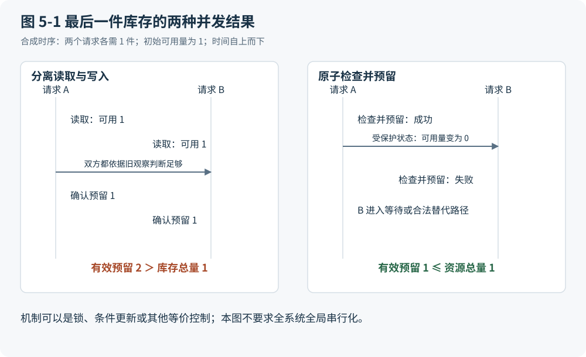

# 第 5 章 正确数据为什么还需要事务和并发控制

## 两个正确的读取能够组成一次错误分配

上一章解决对象和语义的歧义，却没有保证依据记录采取的行动仍然有效。考虑另一条合成开发案例：仓库只剩最后 1 件可用于分配的库存，请求甲和请求乙几乎同时读取这个数量。两者都正确地看见“还有 1 件”，也都只申请 1 件。如果各自先检查、稍后再写入预留，它们就可能同时报告成功。单次读取没有撒谎，错误来自检查与占用之间允许了不受约束的交错。

图 5-1 把这段交错与受控提交并排画出。左侧的关键不是谁更快，而是两次检查都没有锁定自己的前提；右侧则要求检查与建立有效预留作为同一受控变化完成。第二个请求必须看见前提已改变，重新判断、等待或转为有依据的拒绝。让两个 Agent 更准确地复述“不得超分配”，不会代替这个执行条件。

图 5-1：从过时观察推导原子检查与资源约束。本书原创综合；相关依据：F03。

为避免含糊，可以只对图中的固定库存窗口写一个运行时不变量候选：

$$
\sum_{i=1}^{n} r_i \leq 1,\qquad r_i \in \{0,1\}
$$

其中，\(r_i\) 为请求 \(i\) 持有的有效预留数量，只取 0 件或 1 件；\(n\) 为窗口内纳入检查的请求数，右侧的 1 为固定资源总量 1 件。窗口内尚无补货或出库。若加入补货、失效、释放和出库，必须同时定义资源总量及预留如何变化，不能继续照搬这个简化断言。它约束所有允许到达的状态，不只是请求开始时的那次读取。

## 从任务约束选择提交边界

事务的作用可以从这里理解：把需要共同满足约束的状态变化放入受保护的边界，避免只完成其中一部分，或让不允许的交错产生有效结果。Gray 的论述将事务视为受约束的状态变换，同时区分受保护、未受保护和现实动作，明确讨论了长事务的局限。[F03](https://jimgray.azurewebsites.net/papers/thetransactionconcept.pdf) 这个入口不意味着所有业务都应进入一个全局事务，更不意味着数据库提交能够让货物实际存在。

行锁可以暂时阻止冲突修改，代价是等待及锁的持有管理。版本比较允许先并行准备，在提交时验证读取前提，代价是冲突后的重新计算或重试。预留可以把资源占用显式化，代价是处理期限、释放及失去联系的拥有者。这些都是实现选择；机制是否足够，还取决于检查条件是否完整、写入路径是否都经过同一保护，以及旁路操作能否破坏约束。

对高冲突资源，乐观提交可能产生较多无效准备劳动；对低冲突任务，长时间持锁又可能使本可并行的工作互相等待。本稿没有冲突率和延迟实测，因此不能宣布某一机制普遍最优。比较应从相同业务条件出发，测量成功推进、冲突、等待、误拒和恢复成本，再检查代价由系统运维、业务人员还是等待的客户承担。

## 预算检查与授权也会过时

回到 PO-42。本案例在采购时没有锁定付款批次额度，另一并发请求占用了尚未预留的额度，触发 BudgetHold。这里没有给出批次总额度数值，也不能从采购上限 1,000 推导它。采购承诺、应付义务和内部预算额度是不同的账，银行可用现金另列。预算竞争不会让供应商已成立的权利自动消失，处理者需要在授权内调整额度、优先级或安排延期。

当额度问题解决，正式验收仍为 8 件时，按合同假设可以批准本期 800，剩余 200 待验收或争议。800 来自验收数量及每件 100 的计价，而不是把金额降到预算能容纳的水平。随后若有人改动金额或受益人，原批准也不能被当作通用通行证。提交边界应重新核对批准绑定的对象、版本和范围，确认当前动作仍被覆盖；不覆盖时就返回重新判断。

传统系统把锁、版本和批准对象纳入执行路径，有条件上的合理性：多人或多个后台任务都可能在审阅与提交之间改变状态，单靠操作者记住前提难以保护共享资源。由人点击最后一次按钮也不能解决这个时间窗口。Agent 可以缩短准备和审阅时间，却依然需要在产生后果的地方验证前提。

## 幂等解决重试 不替代资源竞争控制

两次不同请求争夺最后 1 件，与同一请求因为网络超时被发送两遍，是两个问题。前者需要判断哪些不同意图能够同时成立，后者需要避免一次意图获得多份副作用。若二者都只被叫作“重复”，设计者可能选错机制。

P2P 后段还有一条合成分支：支付机构收到请求，网络却丢失回执。客户端此时不知道外部效果是否发生。安全重试需要明确业务意图身份、参数一致性和服务端契约；AWS 的工程材料也讨论了迟到请求与保留窗口的成本。[F20](https://aws.amazon.com/builders-library/making-retries-safe-with-idempotent-APIs/) 本案例应保留结果未知，查询或对账，或按同一业务幂等键重试，不能新建支付标识盲付。

但两个分别获授权的合法采购即使金额相同，仍可能是两个意图；不能按文本相似强行去重。反过来，给它们不同幂等键，也不会保证它们合计不超出有限资源。事务边界、资源预留和幂等契约可以组合，但各自保护的断言要写清。跨系统外部后果的恢复细节将留到第 10 章，这里只确立本地提交不能代替外部结果确认。

## 更强一致性并非总是更好

可合并的协作文档和允许事后补偿的预订挑战本章最容易被滥用的结论。不同段落的编辑可能先独立发生，再按明确规则合并；某类预订也可能在已批准的业务策略下容许短暂超额，由后续资源或补偿处理。此时可接受后果已经不同，不能把最后 1 件库存的严格约束未经说明地套过去。补偿仍是后续业务动作，可能失败、收费或损害关系，并不让原后果从未发生。

本章的 I 是在指定任务中守住明确资源约束和授权范围，而非“所有操作全局串行”。H 包括过去只能依靠人工顺序处理来避免冲突的条件；D 包括锁、版本、预留及允许的补偿策略；A 则可能是已无共享约束却仍保留的全局等待。删除等待前，要证明没有把资源冲突成本转移到履约和支持团队。

验收还应要求工作能够推进。若每次看到冲突都永久挂起，系统可能从不超分配，却也不完成任何合法请求。预留需要失效与接管规则，重试需要停止和升级条件，误拒要有纠正路径。并发测试因而既要重放危险交错，也要验证合法请求最终能够继续。在确定哪些状态转换可被接受之后，下一个问题是：为了后来解释这些变化，系统应保存当前值、事件、文档，还是它们的某种组合？
