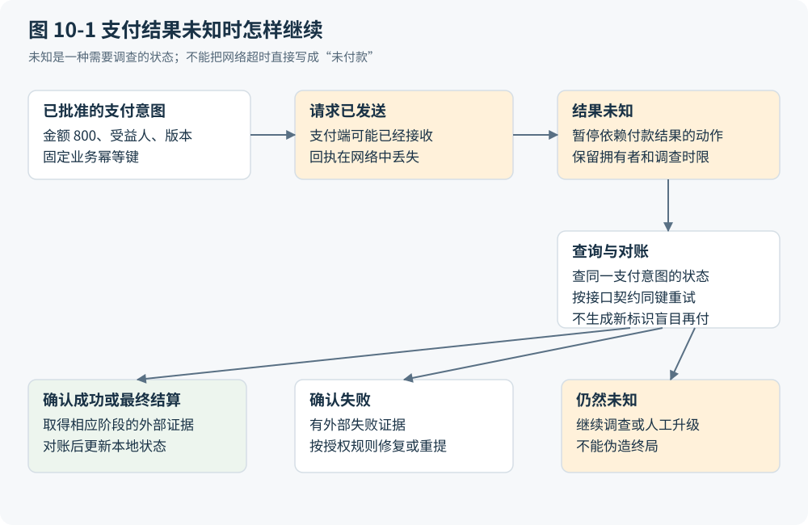

# 第 10 章 连接上另一个系统为什么还没有完成集成

## 连通只是边界问题的开始

上一章把异常还原为未完成责任。跨系统交接让这种责任更难辨认，因为参与者不再共享同一份状态和同一失败范围。ERP 可以记录付款指令已提交，银行可以已经收到请求，而发起方仍拿不到结果。两边的程序各自正常运行，也可能留下无法单靠本地日志回答的业务问题。

集成因此至少需要区分可达性、语义、授权、执行保证、协调与对账。API 可调用解决了如何传递数据和命令，却没有自动回答“这个供应商是谁”“paid 指哪个阶段”“这个调用者能代表谁付款”。消息转换的经典讨论用会计系统和客户关系系统对 Customer 的不同理解说明：字段名称相同，并不等于对象边界和用途相同。[U09](https://www.enterpriseintegrationpatterns.com/patterns/messaging/MessageTransformationIntro.html) 语义差异还可能来自各系统独立形成的设计意图，单看 schema 无法恢复全部背景。[U11](https://queue.acm.org/detail.cfm?id=1103836)

旧式映射、中间件和人工联络正是在这些条件下获得合理性。它们既有格式搬运劳动，也有识别例外和解释双方规则的劳动。减少前者值得追求，后者要么由更明确的合同承接，要么仍由某个责任人承担，不能因为连接器生成得更快就从成本账中删除。

## 一个边界合同应该说清什么

边界合同首先固定对象与语义：来源系统的标识怎样映射到接收系统，数量和金额使用什么单位，状态何时生效，修改指向哪个版本。随后限定主体和动作：服务身份可以调用接口，不代表每一项任务都获准使用其全部能力。最后规定交付与观察：请求可能重复吗，响应表示受理还是最终完成，哪里可以查询，何时需要对账，接口变更由谁维护。

公共数据模型能减少多系统之间重复适配的某些依赖，但每个端点仍须解释自身语义。Hohpe 与 Woolf 的模式讨论也明确呈现了小规模集成中增加中间模型的额外成本；其中适配器数量的示例依赖系统互通假设，不能直接当作项目工时公式。[U10](https://www.enterpriseintegrationpatterns.com/patterns/messaging/CanonicalDataModel.html) 两个系统若只有一条稳定交换路径，一对经过验证的映射可能比组织级统一模型更经济。

工具协议在这里有真实价值，却有清楚的边界。MCP 的指定版本标准化了工具发现、调用、输入输出 schema 和错误表达，并不强制某一种人机交互方式；业务逻辑错误仍须由应用处理，不可信来源的工具注释也不能充当安全保证。[U12](https://modelcontextprotocol.io/specification/2026-07-28/server/tools) 这支持减少接入重复劳动的假说，尚不能证明减少了多少，也不说明整个工具生态永远无法提供更强的业务保证。

## 回执丢失时发生了什么

继续合成轨迹：INV-17 的正式验收仍为 8 件；内部额度问题已经解决，适用合同允许部分付款，有权主体批准了本期 800 单位货币。该批准绑定具体对象、金额、受益人、版本和有效范围。系统以一个稳定的业务支付标识提交请求。银行收到请求后，网络回执丢失，客户端等待超时。

这条轨迹包含三个不同对象：支付意图、一次网络尝试、支付结果。一次意图可以有多次传输尝试；一次超时只证明本次观察未获得结果，不能证明银行没有执行。若系统换一个新支付标识“再付一次”，它可能创建第二个外部效果。若系统一律禁止后续动作，又可能把本来可完成的付款永远悬置。

正确恢复进入“结果未知”分支。优先按原业务标识查询，或等待可关联的结果并对账；若服务契约明确支持同一意图的幂等重试，可以在其有效窗口内使用相同标识和一致参数重试。AWS 的幂等实践讨论将客户端请求标识、参数语义、服务端记录和迟到请求一起处理，恰好说明“加一个键”本身不等于端到端保证。[F20](https://aws.amazon.com/builders-library/making-retries-safe-with-idempotent-APIs/) 两笔独立授权、金额相同的采购仍是不同意图，也不能因参数相似就被合并。

图 10-1 将未知状态置于提交尝试与最终结果之间，并分别标出查询、同一业务幂等键重试、等待对账和人工调查的路径。只有收到相应最终结果并完成对账，才能记录对应的完成状态；明确失败则按其证据转入失败处理。“超时直接生成新支付”不属于允许的恢复路径。本稿只定义这个合成恢复协议，没有执行真实支付，也没有测得恢复成功率。

图 10-1：将结果未知与失败分开并保护重试路径。本书原创综合；相关依据：F03、F20、A016。

## 补偿为何不能抹去已经发生的事

在同一数据库事务中，尚未提交的内部更新可以在其保护边界内回滚。这是重要的强反例：并非每次函数调用都需要一套跨组织补偿协议。若任务完全封闭、所有变化受同一事务管理器控制，直接使用该边界通常更容易解释和验证。Gray 对受保护动作、未受保护动作与真实动作的区分，提醒我们必须先确定事务究竟保护了什么。[F03](https://jimgray.azurewebsites.net/papers/thetransactionconcept.pdf)

跨越外部效果后，修正通常成为新的动作。错误付款即使可以申请退回，也涉及新的请求、对方处理、可能的费用和等待；先前形成的暴露与时间损失仍然存在。补偿还可能与后续合法动作并发，不能简单把所有字段恢复成旧值。Azure 的补偿模式明确指出，补偿逻辑依业务而定，不必恢复原状态，也可能失败或需要人工参与。[A016](https://learn.microsoft.com/en-us/azure/architecture/patterns/compensating-transaction)

有些后果没有可接受的补偿：对外泄露、错过不可延后的期限、不可追回的实物损失。设计必须在不可返回点之前加强验证，并把剩余风险交给有权承担者决定。Saga 或其他编排机制可以组织后续修正，不能使每个外部系统服从同一个回滚语义。本书尚未专项核读 Saga 原论文，不以这个名称替代具体保证。

## 集成完成要有可检验的含义

跨边界执行保留可区分的意图与结果、按风险处理未知后果，是本工作负载中的 I；旧系统只能导出文件或依赖人工转抄，是待逐案核验的 H；采用公共模型、消息总线或工具协议，是 D；同一语义无必要地反复映射、没有责任人的重复对账，是待验证可删除的 A。分类并不替任何现有中间件辩护，也不保证新连接器消除了旧问题。

成本账应分别记录接入开发、语义确认、凭证与权限维护、版本升级、监控、对账和事故恢复。Agent 可能承接映射草拟和资料检索，却会把错误映射的复核、调用范围的检查交给新的运行机制或运营者。节省只在这些职责获得可靠承接后成立。需要注入丢包、重复、乱序、旧版本和合法重复业务的测试，而非只验证一条成功请求。

由此形成的产物是边界合同、失败时序以及结果未知的恢复协议。它们还留下一个人机问题：当系统要求确认映射、补证或批准修正时，人究竟看见什么？下一部从表单开始，讨论界面如何参与信息形成、责任确认和问题发现，而不把它仅仅看作执行引擎外面的装饰。
