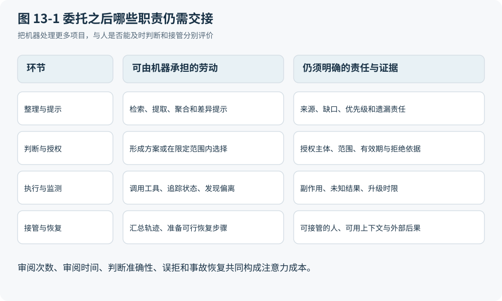

# 第 13 章 把事情交给机器之后谁仍需注意

## 减少待办未必减少劳动

上一章说明界面参与比较与探索，不能全部退化成监督台。即使只讨论明确的执行任务，把正常工作交给机器之后，人也可能仍要处理例外、批准越界动作和恢复失败。判断是否节省时间，需要追踪这些劳动转移到哪里，而不能只数自动关闭了多少任务。

设一批合成发票在相同后端规则和控制下接受处理。正常项目可由确定性流程或受限 Agent 完成，INV-17 因验收差异和 BudgetHold 被升级。若升级只给财务一句“有异常，请确认”，财务必须重新寻找 PO、验收证据、供应商邮件与额度情况。先前节省的逐项操作，有一部分可能变成重建上下文的劳动。这个可能性是一条可检验机制推论，本稿没有真实接管实验来确定其幅度。

通知和待办原本承担可见交接的职责：外部变化到来时，让负责者知道需要行动。工作清单也能表达开放、处理中和完成等视角，以及完成或委派工作项的任务重心。[U05](https://www.sap.com/design-system/fiori-design-web/v1-96/page-types/floorplans/work-list/usage) 但有通知不等于有人注意，已读不等于理解，点过批准也不等于作出了合格判断。每一层都需要单独观察。

## 把“人在回路中”拆开

注意力是有限资源，审阅是动作，决策权是授权关系，接管是能否恢复工作的能力，共同态势则是参与者对当前状态与不确定性的共享理解。它们可能由不同人承担。有人有空看通知，却没有预算调整权；有人有批准权，却看不到必要来源；有人知道应该停止，却没有工具撤销尚未执行的任务。笼统地安排“人工确认”，没有修复这些不匹配。

图 13-1 将这些职责归入整理、判断与授权、执行监测、接管恢复四类环节：机器可以收集资料和提出下一步，审阅者检查证据，授权者决定超出既有范围的动作，运营者在失败时接管，各方通过共同对象与版本理解进展。这是职责视图，不要求固定五个岗位，也不意味着每次动作都须经过五个人。制度已授予确定性规则的批准范围，可以直接执行；低后果且可逆的动作也可以采用更轻控制。

图 13-1：区分信息整理、授权、执行和接管的责任。本书原创综合；相关依据：U01、U05。

对 INV-17，有用的升级应包含两条分开的待决事项：验收仍为 8 件，邮件没有替代正式确认；付款批次额度被另一并发请求占用，需要预算权利人处理。它还应显示已经尝试了什么、哪些动作尚未执行，以及当前安全边界在哪里。把两者压成“建议批准 800”容易诱使审阅者忽略额度尚未解决；只列红色告警又迫使人重新推导整个案件。

## 一个可核算的注意力预算

为避免把监督劳动当作免费资源，可以先建立有限观察窗口内的时间账：

$$
T_{\mathrm{human}} = T_{\mathrm{triage}} + T_{\mathrm{review}} + T_{\mathrm{context}} + T_{\mathrm{takeover}} + T_{\mathrm{recovery}}
$$

其中，所有变量单位均为人分钟；各项依次表示分流、实际审阅、重建上下文、接管准备和恢复操作的主动劳动，须按互斥编码记录，避免同一段时间重复计数。这是测量恒等式，不是人的认知模型。任务等待时间另计；前期培训、评估与演练也应另列，不因它们没有发生在这张发票上就删去。

总量还不足以描述是否来得及。某一小时的关键异常可能集中到唯一有权处理的人身上，不能用其他人的空闲时间抵消。注意力预算应按角色和截止窗口核对工作量与可用能力，并保存优先级规则。合并通知可以降低切换，但若把临近期限的项目藏在汇总中，也可能增加损失；频繁推送可以提高可见性，却可能挤占更重要的判断。两者都需要任务条件。

因此，升级合同应明确触发条件、接收者、所需决定、截止时间、证据摘要和来源、允许动作、未响应后的下一步。升级精确率关心送来的项目是否真需要该角色介入，召回率关心该介入的项目是否被遗漏。两个指标必须一起报告，不能靠少发通知制造清静，也不能靠全部上报逃避判断。

## 最难的工作会不会最后才交给人

自动化可能改变人接触任务的分布。若正常项持续由机器完成，人得到的多是证据冲突、少见故障和不可直接恢复的情形；如果同时失去对正常过程的熟悉，就可能更难判断当前异常意味着什么。这就是本书要检验的“自动化反讽”：承担更少日常操作的人，可能被要求在更少上下文中处理更难的接管。本版尚缺这项人因机制的专项原文核读与现实测量，因此不能把它写成已证实的普遍效果。

可以通过接管演练使主张可检验。向各设计注入同一条支付回执丢失轨迹，观察处理者能否判断结果未知，找到原业务标识，避免新建支付，并沿允许路径查询或对账。记录发现问题、理解状态、获得工具和完成恢复各阶段的时间与错误。演练应保留失败，不把人最后纠正了系统当成系统原本正确，也不把正确拒绝无权动作算成无用。

一个强反例是低风险、可逆、规则稳定且恢复完全明确的任务。若自动化能可靠完成并在边界处停止，要求人逐项保持态势可能纯粹增加成本。另一个反例是预先充足的恢复上下文和熟练运营团队：自动化不必导致技能退化或接管变慢。设计选择应接受这些反例，而非以“人总得监督”证明所有通知和审批必须保留。

## 让省下的时间有明确去向

约束分类可落在每次交接上：有时限且超出机器授权的决定须有能够承担者，是相应范围内的 I；靠逐单查看才能发现状态变化，是待核验的 H；通知、轮值队列、合并摘要和接管台是 D；无人行动却重复抄送、没有差异仍逐项确认是待删除的 A。注意力需求可能保留，介入频率弱化，路由迁移到机器，特定提醒消失；每个判断都须给出替代机制。

成本的承接者可能不对称。业务人员少操作了，财务可能多审阅了，平台团队可能多维护升级规则了，供应商可能多等了。只有把这些变化放在同一任务边界中，才有资格谈总节省。视觉历史和可回看的关系可以帮助核验，但经典可视分析任务分类只提供设计入口，并不证明某种接管界面已经有效。[U01](https://www.cs.umd.edu/users/ben/papers/Shneiderman1996eyes.pdf)

本章留下的是注意力账、升级合同和接管演练。下一章还要追问一层：某个人看见了、理解了，也有能力点击，是否就有权改变相应状态？如果没有在执行路径中限定权力，精心设计的人机配合也可能只让越权发生得更顺畅。
