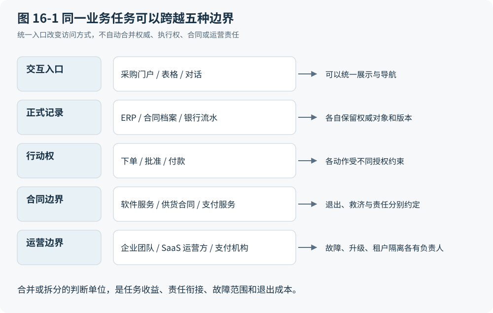

# 第 16 章 一个应用的边界是谁画出来的

## 发票跨过了三种产品

实施把本地工作接入软件，却未必能把一项工作收进一个软件。PO-42 的采购承诺可能记录在 ERP，允许部分付款的条款在合同工具，最终结算结果来自银行。员工看到的是一张发票要完成，三个系统承担的却是不同责任。用一个对话入口调用三者，可以缩短寻找页面的时间；它并不因此成为合同解释者、支付授权者和结算机构。

仍以合成轨迹为例，INV-17 主张 1,000 单位货币，正式验收只支持其中 800。合同工具返回部分付款条款，ERP 根据已采纳证据形成候选支付，银行接收获准指令后回执丢失。此时统一入口必须呈现“结果未知”，并让任务继续查询或对账。若入口为了简化体验只显示“已完成”，它就掩盖了跨边界工作的关键状态。相反，若三个产品每次都要求人重录相同对象，也不能以“边界必要”为重复劳动辩护。

协调理论将活动间依赖作为分析对象，同一依赖可以由排队、预算、管理决定等不同机制处理。这使我们能够先问谁依赖谁，再判断产品应否合并；它没有证明依赖减少就必然消灭组织或应用。[F04](http://ccs.mit.edu/papers/CCSWP157.html)

## 五条线未必画在同一处

图 16-1 将同一任务的五种边界分层标出。读图时应追踪一项状态由谁创建、谁允许改变、谁负责恢复，不应把最外层的产品方框当成所有责任的共同边界。

图 16-1：区分产品边界中的界面、记录、执行、合同与运营。本书原创综合；相关依据：F04、F21、U10。

| 边界 | 本例要回答的问题 | 合并入口后仍需交代的事项 |
|---|---|---|
| 交互入口 | 员工在哪里表达目标、检查差异 | 用户能否找到来源、修改或接管 |
| 正式记录 | 哪个系统记载特定对象与版本 | 谁可更正记录，如何处理冲突 |
| 行动权 | 谁能批准部分付款并提交指令 | 委托范围、金额与受益人的校验 |
| 合同边界 | 谁购买服务、承担费用 | 计费、退出及过渡服务的约定 |
| 运营边界 | 哪一方处理故障和积压 | 隔离、停止、恢复与服务责任 |

正式记录还需要字段、时点与用途限定。合同工具可能负责保存签署文本，ERP 负责会计期间的账簿，银行负责其受理和结算记录。它们的权威范围不同，任何一方都可能发生错误并按程序更正。一个产品也可以同时承接其中多种职责，不能从“正式记录”这个名称推断它只能做被动存储。

历史上的 System of Record 与 System of Engagement 提供了记录与互动重心的观察角度。AIIM 委托的白皮书同时提示互动内容也有治理问题；它是战略分析材料，不是互斥产品分类标准。本书增加的行动权视角同样是分析工具，不能冒充已有的三分定理。[F19](https://info.aiim.org/hs-fs/file-2314261840-pdf/Inbound_Assets/Systems-of-Engagement.pdf)

## 套件和专业工具各省了什么

一体化套件可以让对象、权限和版本在较少接口之间流动。负责同一条流程的团队更容易发现失败，采购也可能只需谈一份主合同。这种设计在任务关联紧密、共享口径稳定时有合理性。它的代价可能是局部工作必须服从共同模型，单个模块升级又牵动更大的验证范围。套件减少多少协调成本，应与新增的适配及共同故障成本一起看。

专业工具则可能更适合特定负载：合同文本的协商与修订，并不天然适合用付款队列表达；银行支付也有独立的外部契约。组织中的不同预算与权力中心会分别采购，供应商又决定哪些功能打包销售。因此，今天看到的产品边界通常混合了任务差异、组织分工和商业选择。专业化可以改善局部工作，也把跨产品语义、身份与故障处理交给买方集成团队或服务商。

多租户服务又增加了一条容易混淆的线。多个客户共享基础设施，不代表可共享业务数据；认证成功、拥有某项功能权限，也不足以证明租户隔离。AWS 的架构材料要求资源访问考虑租户上下文，支持“共享运行环境而保持访问隔离”这一机制，不要求每个租户独占服务器。[F21](https://docs.aws.amazon.com/whitepapers/latest/saas-architecture-fundamentals/tenant-isolation.html) Agent 集中调用多个服务时，更需检查调用所带的主体与租户范围，不能用“它知道客户是谁”代替资源层的限制。

## 接得通以后仍要对得上

统一工具协议能减少发现接口、描述参数和发起调用的劳动。MCP 的工具规范定义了这些能力，并区分协议错误与工具业务逻辑错误。这说明接口响应成功与采购任务正确完成之间仍有距离；它不能反过来证明更高层的契约永远无法通过协议或生态建设来提供。[U12](https://modelcontextprotocol.io/specification/2026-07-28/server/tools)

设 ERP 将“供应商”指向开票法人，合同工具按集团主体归档，银行接口要求具体受益人。三者都接受一个字符串标识，也不会自动获得相同语义。公共数据模型可集中部分转换，降低各系统两两依赖，却仍需维护每端映射；系统较少时，中介本身还会增加工作。Hohpe 与 Woolf 的模式说明了这种取舍，其特定互连条件下的转换器数量不能直接变成任何项目的成本公式。[U10](https://www.enterpriseintegrationpatterns.com/patterns/messaging/CanonicalDataModel.html)

沿本书分类，正确主体、有效授权，以及外部后果可追踪并有处置责任，属于指定任务的 I；曾因网络、终端或接口能力而形成的分隔，可能含 H；一个门户、多个服务或公共模型属于 D。恢复能力须按动作另定，有些外部后果只能补偿，有些损失不可补救。重复维护同一份已无独立用途的映射，只有通过删除测试后才可判作 A。边界合并的成本表至少应列出旧责任人、新责任人、一次迁移劳动、持续核验劳动、故障影响范围及退出办法。否则只是把集成工作移到 Agent 运行时，并没有证明它消失。

## 合并的反例与拆分的反例

最直接挑战“边界必须保留”的，是小组织的轻量系统。在单一责任主体、少量低风险任务、可恢复操作和清晰分工的条件下，一份设计良好的共享表格或简单应用可能同时承担输入、记录与排程；再加多个产品只会制造身份同步和管理负担。这不意味着银行的外部结算责任也被表格吸收，而是本地软件无需预先模仿大型企业的全部分层。

反方向的强反例，是让一个高权限 Agent 成为所有服务的唯一入口与运营中心。即使每次正常调用都更快，它的错误配置、不可用或身份上下文缺陷也可能同时影响多个域。原来可以单独停止的模块失去独立恢复入口，便是合并产生的新成本。这种风险不是对话界面的必然属性，而取决于委托、隔离和备用操作路径的具体设计。

所以，应把合并与拆分都视作可检验方案：在同样任务和风险边界下，比较少掉了哪些转换、增加了哪些责任、故障能否隔离，以及退出时能否带走对象、规则和未完成工作。入口聚合、后端独立可以是合理中间态；一体化也可能真正降低总成本。目前没有证据支持所有边界终将收敛到一个 Agent，或所有现有产品都应保持独立。下一章还要进一步分开：即使某种边界降低了技术成本，这部分收益究竟会落到买方、卖方，还是承担新增劳动的人身上。
