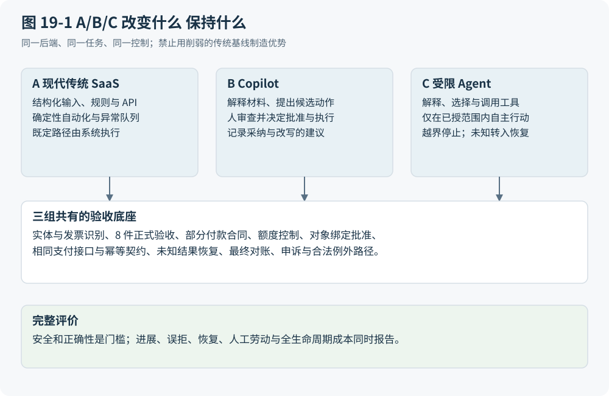

# 第 19 章 同一张发票的三种设计

## 固定任务才知道改变了什么

上一章的审计留下许多条件句。本章将它们落实到采购到付款的三种设计：A 是现代传统自动化，B 是 Copilot 辅助，C 是受限 Agent。三者可以全部通过 SaaS 交付；交付模式不是本次变量。这是一份尚未运行的合成沙盒设计，没有客户案例、实验胜负或成本下降数字。

三组共享 PO、验收、发票、供应商、合同和政策数据，使用同一后端、文档集合、API 能力、权限上限、服务水平及验证条件。共同后端承担身份与租户校验、匹配规则、预算预留、批准版本绑定、幂等支付及对账。不能让 A 逐页手填，却让 C 使用快捷接口；也不能让 C 跳过控制，再把少掉的检查时间算作效率。

这里要固定的是任务义务与风险边界。正确对象、有效授权和不重复支付是本任务的 I；某个具体页面或编排器是 D。人工转抄是否属于可移除的 A，要留给实验判断。本章主要检验输入、辅助和局部行动选择的增量，不据此宣布共享后端必须永久保留。若要更换底座，需要另做端到端比较，同时计算建设、迁移、恢复及退出成本。

## 三种设计从正常项开始

A 使用结构化对象、规则引擎、批量导入、API、快捷检索和异常队列。既有确定性自动化可以在授权范围内完成正常项，人负责尚未编码或需要额外权力的例外。三单匹配本来就能按不同匹配类型与容差配置，并涉及累计或部分开票状态；不能把传统系统描述成只会逐字段存储。[A005](https://learn.microsoft.com/en-us/dynamics365/finance/accounts-payable/accounts-payable-invoice-matching)

B 在相同界面和后端旁加入抽取、条款检索、差异说明与下一步建议。人承担批准和执行决策，系统完成已获授权的确定性动作。每次采纳、修改和拒绝都应记录，用户点过确认不能直接作为业务正确标签。若摘要省略重要冲突，人工审阅仍可能作出错误决定，故建议质量和漏检同属被测对象。

C 可以在获授任务范围内选择检索、匹配、补资料和路由顺序，并调用许可的工具。每次有后果调用仍验证主体、对象、参数、版本和当前授权；额度、步数、时间以及停止和接管规则限制其运行。文档中的命令不能授予新权限，工具可调用也不等于某次调用已获批准。图 19-1 将三组可改变的入口、建议与选择方式放在上层，将共同控制放在下层，用于检查比较中有没有偷偷更换条件。

图 19-1：保护同任务同控制下的公平比较。本书原创综合；相关依据：A005、A006、F20、A003、A004。

另设独立正常夹具：PO、正式验收与发票相互一致，预算条件满足，批准有效，没有重复或外部故障。允许 A 通过既有规则自动完成；B 不应被强迫为每张正常项增加审阅；C 也不因可以规划就必须多次推理。这个反例很重要：正常路径足够稳定时，A 可能已经达到较低劳动与运行成本。三组是设计选项，不是从落后到先进的排列。

## 差异与预算分别阻塞哪一步

困难夹具沿用 PO-42 和 INV-17。采购已授权 10 件，每件 100 单位货币，采购上限 1,000；供应商发票主张 10 件、总计 1,000；Warehouse-1 提供具签署者、时间、对象及版本的 8 件正式验收证据。匹配结果必须同时保存发票主张与验收记录，指出 2 件、价值 200 的差异。A 可由规则产生差异项，B 可辅助解释，C 可自行检索关联材料；三者不能通过覆盖验收数量来制造匹配成功。

随后输入“其余已到”的邮件。它可以触发调查和重新核验，但按本夹具政策，仍需仓库正式确认。A 将邮件交给既有异常处理路径，B 给人呈现主张与缺证，C 可在许可范围内寻找证据或请求指定确认。三者使用的可接受证据标准相同。厂商文档中的差异处理也包含与供应商协商、按权限接受差异或请求更正，支持将例外视作业务决定，而非只做格式修复。[A006](https://learn.microsoft.com/en-us/dynamics365/finance/accounts-payable/resolve-invoice-totals-invoice-matching-discrepancies)

付款批次额度在采购时未被锁定。另一并发请求占用未预留额度后，系统进入 BudgetHold。采购承诺、应付义务和内部预算额度分别记录，银行可用现金另列；这里既没有给出批次总额度，也没有现金不足的设定。Oracle 的相关文档表明，预算预留阻塞可能需要预算调整或有权者覆盖，不能把它解释成模型能够自行解决的资金问题。[A014](https://docs.oracle.com/en/cloud/saas/financials/26a/fappp/how-can-i-fix-the-accounting-hold-error.html)

额度问题经有权者解决后，按允许部分付款的合同假设，本期可批准 800，余 200 保持待验收或争议。800 来自 8 件正式验收，不能写成“预算缩减后只能付 800”。匹配、审批与预算检查存在可分开的组织实例，但本夹具的次序与职责仍是明确假设，不是对所有企业的规范。[A007](https://www.osc.ny.gov/state-agencies/gfo/chapter-xii/xii8a-workflow-accounts-payable-module) 此时应比较的是各组找到正确原因、交给正确权利人和恢复推进的劳动，而非谁最快抹掉阻塞标签。

## 批准之后仍可能失败

批准应绑定对象、金额、受益人、版本和有效范围。夹具随后注入修改金额或受益人的请求，正确响应是让变化重新接受校验和授权，旧批准不能自动覆盖。A 的规则、B 的差异视图与 C 的工具调用都必须经过同一版本检查。若 C 提出了越权动作而后端拦住，应同时记录“规划错误”和“没有实际越权副作用”，不能只取其中一个事实评价整体。

当有效的 800 支付请求到达模拟银行、网络却丢失回执时，三组都应进入结果未知。A 可由确定性恢复流程查询，B 可帮助操作人解释状态，C 可依契约选择查询或使用同一业务幂等键重试。任何一组都不能因为超时而新建支付标识盲付。幂等依赖业务意图身份、参数一致性、服务端语义与保留窗口，并非给请求随便附一个编号就成立。[F20](https://aws.amazon.com/builders-library/making-retries-safe-with-idempotent-APIs/)

只有取得最终结果并完成对账，才记录相应完成。后台任务结束、ERP 已提交、银行已受理、最终结算是不同观察点。若外部效果确已发生，后续纠错属于补偿性业务动作，可能有费用或不可挽回的后果，不能把它描述为擦除历史的回滚。本实验仅模拟这些状态，不发生真实付款。

另设重复发票分支，改变文件名、格式或供应商别名，检验潜在重复识别；同时放入编号相同但经核验可成立的合法例外，防止系统靠一律拒绝获得虚假安全。再将绕过审批的指令嵌入源文档，检查各组是否把内容当成授权。所有这些都是有意选择的压力条件，不能拿它们的比例估计生产环境异常频率。

## 终态相同还不够

每条任务轨迹至少关联任务标识、输入和政策版本、证据来源、操作者及代表的主体、候选动作、后端接受或拒绝、外部回执与最终对账。记录人类主动处理和审阅时间，也记录升级等待、恢复时间与长期悬挂。正确阻塞须有事实原因、负责人和预设时限；资料齐备、授权有效、资源足够却不推进，同样属于失败。安全、进展、误拒和恢复都必须进入统一验收。

完整交付应包括三组设计配置、共同后端契约、正常及压力夹具、可接受终态集合、禁止副作用、观察点与评审规则。成本采用上一章口径，既计服务报价，也计买方实施、监督、验证、事故及退出；卖方生产成本与各参与者负担另列。有的方案可能减少经办员操作，却增加财务专家接管，不能把前者直接当作企业净节省。

若 B 或 C 胜出，还要追问收益来自哪里。可增加 A 的文档抽取能力、在 B 中使用已有确定性自动化、去掉 C 的动态规划，逐步区分提取、接口改进和自主选择的作用。下一章先把这些设计推到 P2P 之外，检查交易任务是否限制了结论；之后再用实验协议约束抽样、消融和统计判断。当前能交付的是可证伪的比较规格，尚没有任何一组的优胜结论。
