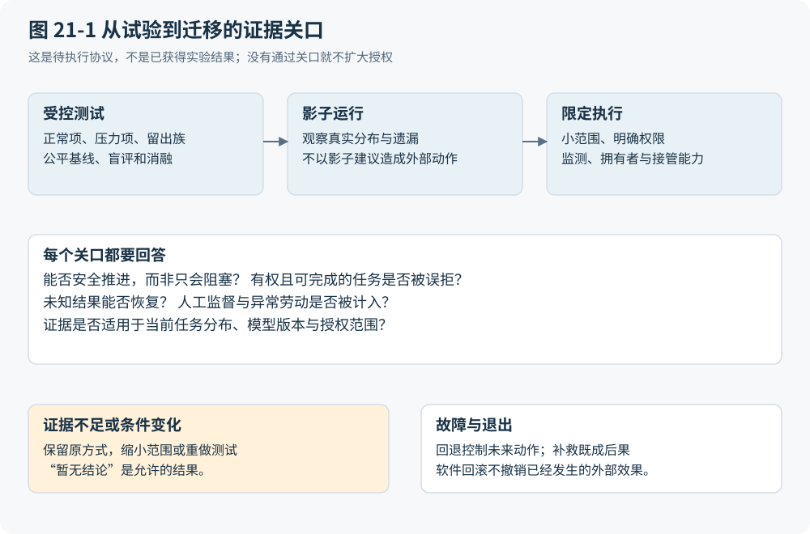

# 第 21 章 怎样证明重构真的更好

## 先写下允许失败的判断

上一章留下的预测，需要能够拒绝它们的实验。本章提出预注册草案，尚未运行比较，也没有可靠性、节省比例或优胜组别。演示能说明一条路径可走通，不能说明遇到另一种证据、并发顺序或工具失败时仍成立。能力、业务正确、安全与经济收益是不同层次的命题，不能由一次成功逐级代替证明。

第 19 章的合成轨迹说明了这种区别。系统从 INV-17 提取出 1,000 单位货币，可能准确完成了文档任务；若据此认定 10 件均已验收，业务判断仍错。Warehouse-1 正式验收 8 件，合同允许部分付款；额度问题解决后可批准的本期 800，来自验收依据。银行收到请求而回执丢失时，正确状态又从“已提交”转为“结果未知”，不能由流畅的完成说明填补。实验必须观察这些边界，而非只看最后一段回答。

预注册应先指定主要问题：同样控制下，辅助解释或动态行动选择是否减少人类主动劳动；遇到长尾异常时，错误完成与恢复负担是否改变；加入建设、监督、升级和退出后，总成本是否下降。方向可以未知，但分层、分母、可接受差异及停止规则须在看结果前确定。回归测试、沙盒和影子运行的历史价值，在于用不同条件逐步积累证据；采用它们并不等于先认定旧架构更安全。

## 两种公平比较不能互相冒充

受控增量试验固定数据、政策、权限、后端、API 能力和服务要求。A 是具有规则、批量处理与确定性自动化的现代传统 SaaS；B 是辅助式 AI，即 Copilot，由人承担关键批准和执行决策；C 是受限 Agent，只在获授范围内选择与执行。三者可以使用相同的 SaaS 交付方式，比较的是控制和交互变化。不能把 A 刻意改成逐字段手工操作，也不能让 C 获得更完整的资料或更宽的权限。

端到端重构比较则允许更换实现，只固定业务验收、授权上限、隐私与风险边界，并计入全部迁移劳动。前一种比较可以识别模型的增量，却不能独自证明某个旧组件可取消；后一种能检验重构，却不能把更好的 API 或数据清理全部算作 Agent 收益。相同控制意味着相同义务与后果边界，不意味着永远保留每一级旧审批。

还应加入消融：给 A 增加文档提取，给 B 增加确定性提交，或从 C 去掉动态规划，分别观察变化。参与者按预设方案随机分派，或以平衡次序使用不同但可比的任务，避免先看过答案再进入另一组。培训时间和熟练度也要记录。评审尽可能不见组别；两名评审有分歧时，由第三人依据冻结的验收条件裁决，不能以系统自称完成作为标签。

## 正确终态必须与禁止后果一起判定

金标准应保存一组可接受终态，而非要求所有系统复制同一脚本。τ-bench 提供了结合领域政策与最终数据库状态的评价入口；Thinkingbox 进一步把错误、遗漏和额外的持久副作用分别检查。这些是方法参考，不是本书 P2P 实验的成绩。[A008](https://arxiv.org/abs/2406.12045) [A010](https://arxiv.org/html/2608.19741)

对于有合法路径的任务，实验同时检查是否按时推进，以及是否错误拒绝、遗忘或无限等待。对于缺证或无权行动的任务，合理阻塞须带依据、拥有者和继续条件。安全与进展的概念区分可追溯到程序正确性研究；将它用于这里的业务指标，是本书的分析扩展。[R02](https://lamport.azurewebsites.net/pubs/proving.pdf) 一个从不付款的系统可能没有重复付款，却不能因此赢得比较。

安全记录还须拆成越权提议、后端拦截和实际副作用。后端拦住了错误请求，说明这次控制有效，却不说明规划正确；反过来，一次无害的错误提议也不应被计成已经造成损失。恢复测量从故障被引入开始，记录发现、诊断、查询、接管到重新形成可接受状态的时间与劳动。平均处理时间以外，应报告端到端分位数、审阅漏检、升级等待和恢复长尾。

## 样本不能靠重复运行凭空变多

任务按正常输入、字段噪声、语义冲突、缺证、权限冲突、并发、外部超时、恶意内容与真实不可实现条件分层。自然业务样本用于估计适用组织的分布；有意制造的压力集用于暴露机制弱点，两者分别报告。库存、案件、探索和连续控制已经参与模型开发，不能再列入未见留出集。新案例应由独立研究者保留，试验后才揭示其判断依据。

重复运行同一发票可以观察路径波动，却没有生成新的供应商、政策或业务困难。报告须同时列出独立业务案例数、重复次数及相关来源；共享模板、同一操作者和同一配置造成的相关性，要进入分组分析和不确定性说明。若无法支持所选统计假设，应报告描述结果及限制，不能硬套置信区间。

零事件也有明确边界。只有在固定样本量、独立同分布的伯努利试验、同一真实错误率且能够完整发现事件等条件下，观察到零次错误才有如下单侧精确置信上界：

$$
P(X=0\mid p)=(1-p)^n,\qquad p_{\mathrm{upper}}=1-\alpha^{1/n}.
$$

这里，n 是独立试验数，p 是该试验总体的单次错误概率，X 是错误次数；α 是显著性水平，所对应置信水平为 1−α。各量均无量纲。这是零事件条件下的统计计算，不是现实风险为零的证明，也不能用于把相关重跑当成 n 个独立样本。持续看结果后临时决定何时停止、漏掉未被日志发现的错误，或把不同风险任务混成同一错误率，都会破坏这里的适用条件。

## 成本必须找到承担者

预先定义同一观察期，成本账才有可比性。一个最简单的未折现记账式是：

$$
C_g(T)=F_g+\sum_{t=1}^{T}\bigl(P_{g,t}+L_{g,t}+V_{g,t}+R_{g,t}\bigr)+X_g.
$$

g 表示 A、B 或 C；T 是共同观察期包含的等长期间数；F 是一次性建设与迁移成本，P 是各期服务和基础设施支出，L 是操作、审阅及协调劳动成本，V 是验证与治理成本，R 是故障损失及恢复成本，X 是相同退出情景下的成本。货币项统一币种与价格基准，支出只归入一项，避免重复计入。未发生的未来事故和退出费用须标为情景估计，不能伪装成已观察开销；长期比较需要另外交代折现与价格变化。

模型费用只是 P 的一部分。采购员少做录入、财务多做纠错、供应商多次补资料，可能同时发生。工资按时间换算的机会成本与实际可削减支出应分列，人员省下十分钟不自动成为十分钟现金收益。收益判断应先满足不可交易的权限与安全边界，再比较可行方案；不能用便宜抵销禁止发生的后果。

## 把无结论写进交付格式

协议文件应冻结任务与场景编号、数据及政策版本、允许终态、禁止副作用、时限、授权范围和评审规则。轨迹另存观察版本、建议、批准、调用、回执与对账的关联标识；模型版本、提示、检索语料、工具说明、预算和重试策略都属于复现配置。基准自身也会修正错误任务，因此报告必须固定所用版本，不能把不同时期的题库当作相同实验。[A009](https://github.com/sierra-research/tau2-bench)

结果报告可用一张简短空模板开始：“场景层〔待填〕；独立案例数与重跑数〔待填〕；A/B/C 的正确完成、合理阻塞、误拒、停滞及错误完成〔待测〕；安全事件、恢复时间与生命周期成本〔待测〕；区间、评审分歧及未覆盖范围〔待填〕”。所有空格保持空白，比填入期望数字更有价值。

沙盒不产生真实付款或外部业务动作。模拟严重越权、泄密或重复支付触发预定停止调查，失败轨迹仍计入报告，不能在修好以后删掉。小规模预试验可修测量方法，确认性试验应另行冻结；允许最终只支持正常项、支持混合设计，或暂时无法区分三组。图 21-1 将这些证据关口连接到下一章的迁移权限：即使试验通过，也只支持已经测量的范围，不自动授予生产行动权。

图 21-1：把验证证据与逐步扩大的迁移权限相连接。本书原创综合；相关依据：A008、A009、R02、F14、A016。